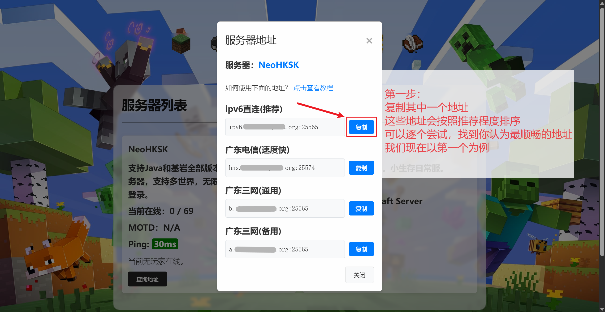
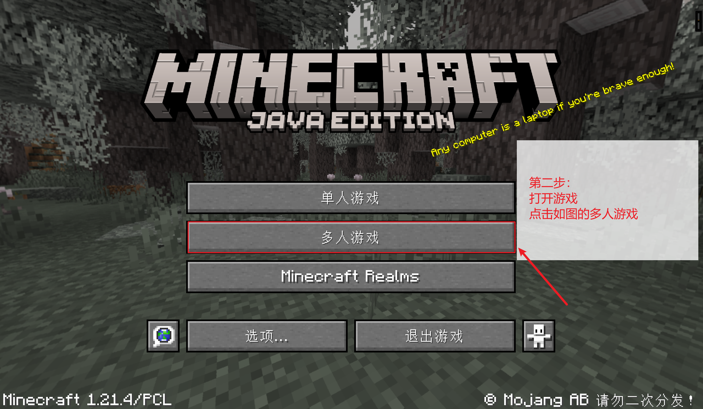
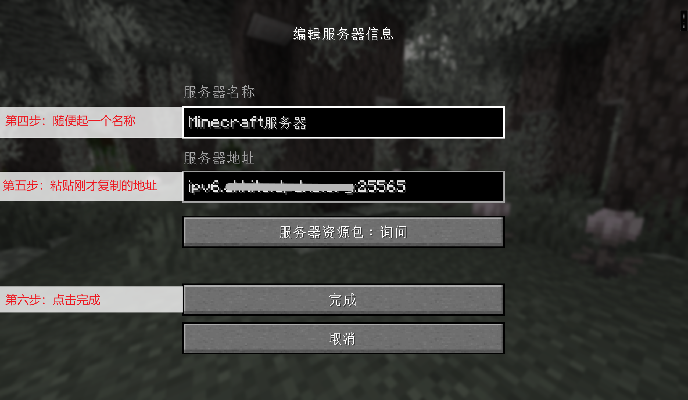

# 🎮 联机进入指引

欢迎加入 CSUFTMC！请根据您使用的设备版本，点击下方对应的快速跳转链接：

👉 [Java版指引](#java-guide) | [基岩版指引](#bedrock-guide)

---

## ☕ Java版进入服务器教程 {#java-guide}

::: info 准备工作
* **推荐启动器：** [PCL2 官方下载](https://ifdian.net/p/0164034c016c11ebafcb52540025c377)
* **适用人群：** PC 端玩家，支持正版及离线登录。
:::

### 🛠️ 分步操作指南

**第一步：获取服务器地址**
在官网上点击复制最适合您线路的地址（例如 IPv6 直连）。

---

**第二步：进入多人游戏界面**
启动游戏后，在主菜单点击【多人游戏】。

---

**第三步：选择添加服务器**
点击右下角的【添加服务器】按钮。

---

**第四步：配置服务器信息**
1. **服务器名称**：随便起一个名字（如 `CSUFTMC`）。
2. **服务器地址**：粘贴刚才复制的地址。
3. 点击【完成】。

---

**第五步：加入游戏**
在列表中找到服务器，点击【播放箭头】或直接双击即可进入世界！

---

## 📱 基岩版进入服务器教程 {#bedrock-guide}

::: warning 版本兼容性与安全须知
* **专用客户端下载：** [点击前往下载页](https://bbk.endyun.ltd/download)
* **当前支持版本：** `正式版 1.21.111` - `1.21.130` 
* **⚠️ 重要提示：** 基岩版更新频繁，覆盖安装可能导致**本地存档丢失**。强烈建议将此客户端**仅作为连接服务器的专用工具**（不建议在此客户端进行本地存档游玩）。
:::

### 🛠️ 分步操作指南

**第一步：完成账号登录**
首次进入需登录微软账号（无论是否购买均可）。看到左侧显示您的用户名后，点击【游戏】。

---

**第二步：切换至服务器选项卡**
点击顶部的【服务器】，然后拉到列表最下方，点击【添加服务器】。

---

**第三步：手动录入参数**
1. 参照官网地址，填入**服务器地址**。
2. **特别注意：** 修改**端口号**为服务器指定的 5 位数字（非默认的 19132）。
3. 点击【保存更改】后加入。

---

::: tip 常见连接问题排查
* **无法连接世界？** 请检查端口号是否填写正确。
* **版本不匹配？** 请确认客户端版本在 `1.21.111 - 1.21.130` 之间 。
* **网络波动？** 尝试在[服务器列表](/servers.md)切换其他分流节点（如从 IPv6 切换至三网线路）。
:::