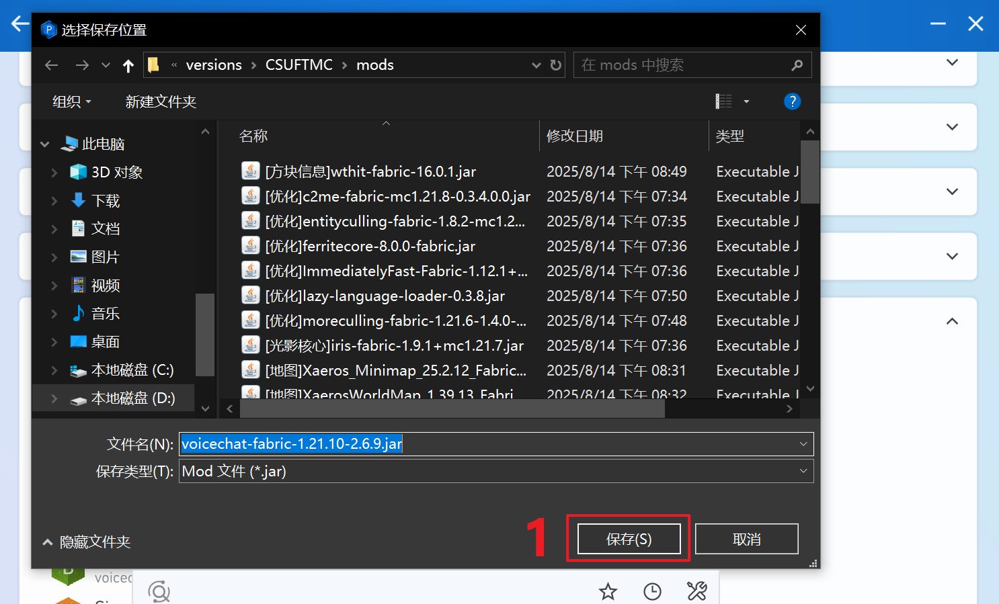

# 🎤 语音系统配置 (Simple Voice Chat)

为了提升联机互动体验，服务器已支持 **Simple Voice Chat**。安装后您可以与身边的玩家进行实时距离感应语音。

---

## 🛠️ 安装步骤

::: warning 安装前必读
本 Mod 运行需要 **Fabric API** 支持。如果您使用 PCL2 启动器，请确保在“版本设置 -> 核心组件”中已安装 Fabric API。
:::

### 第一步：下载 Mod 文件

1. **搜索插件**：在下载页面或启动器内搜索“简单的语音聊天”。

2. **选择版本**：请务必选择与您当前游戏版本（如 `1.20.10`）及加载器（`Fabric`）一致的版本。

3. **保存安装**：点击下载并保存至 `mods` 文件夹。

---

### 第二步：进入游戏并自检

连接服务器后，请观察屏幕左下角的语音状态图标：

| 图标状态 | 含义 | 处理建议 |
| :--- | :--- | :--- |
| **🚫 红色插头** | Mod 已加载，但语音服务器连接失败 | 检查是否开启了代理软件（VPN），请关闭后重连。 |
| **🎙️ 麦克风图标** | **连接成功** | 您可以正常说话了！ |
| **无图标** | 未安装或未启用 | 请检查 Mod 列表是否包含该文件。 |

---

## 🎮 操作指令与按键

进入游戏后，您可以使用以下快捷键（可在游戏设置中更改）：

* **`V` 键 (核心菜单)**：打开语音主菜单，可调节麦克风感应灵敏度、音量、测试音源。
* **`M` 键 (一键静音)**：快速关闭自己的麦克风。
* **`H` 键 (隐藏界面)**：隐藏左下角的语音状态显示。

::: tip 语音模式建议
在 `V` 菜单设置中，您可以选择 **激活模式**：
1. **语音激活 (Voice Activation)**：说话即发言（需调节好灵敏度）。
2. **按键发言 (Push-to-Talk)**：设定一个快捷键，按下才说话。
:::

---

## 💡 常见问题 FAQ

::: details 听不见声音/麦克风没声音？
按 `V` -> `Settings` (设置) -> 检查 `Input Device` (输入设备) 和 `Output Device` (输出设备)。
*请确保选择的是您正在使用的耳机和麦克风。*
:::

::: details 语音连接一直显示红色插头？
1. **网络拦截**：请检查您的防火墙是否拦截了 Minecraft 的 UDP 通讯。
2. **代理冲突**：若使用了加速器或代理，请尝试切换模式或关闭。
3. **节点问题**：移动 IPv6 用户若无法连接，请尝试在官网切换至三网节点。
:::

::: details 游戏安装 Mod 后崩溃？
通常是由于缺少前置组件。请检查 `mods` 文件夹内是否已放入对应版本的 **Fabric API**。
:::

---

**遇到无法解决的技术问题？** 请联系管理员或在社区群内求助。